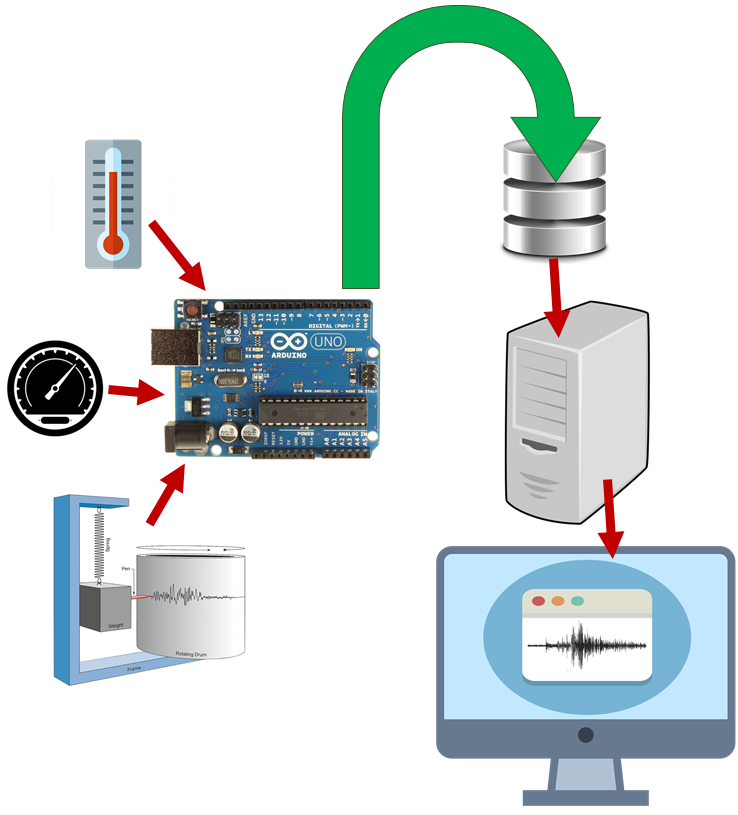
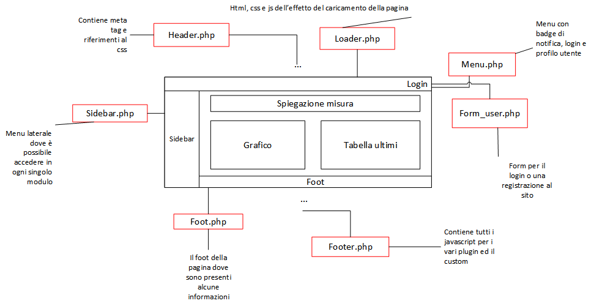
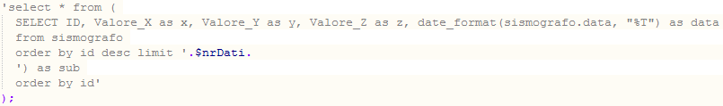
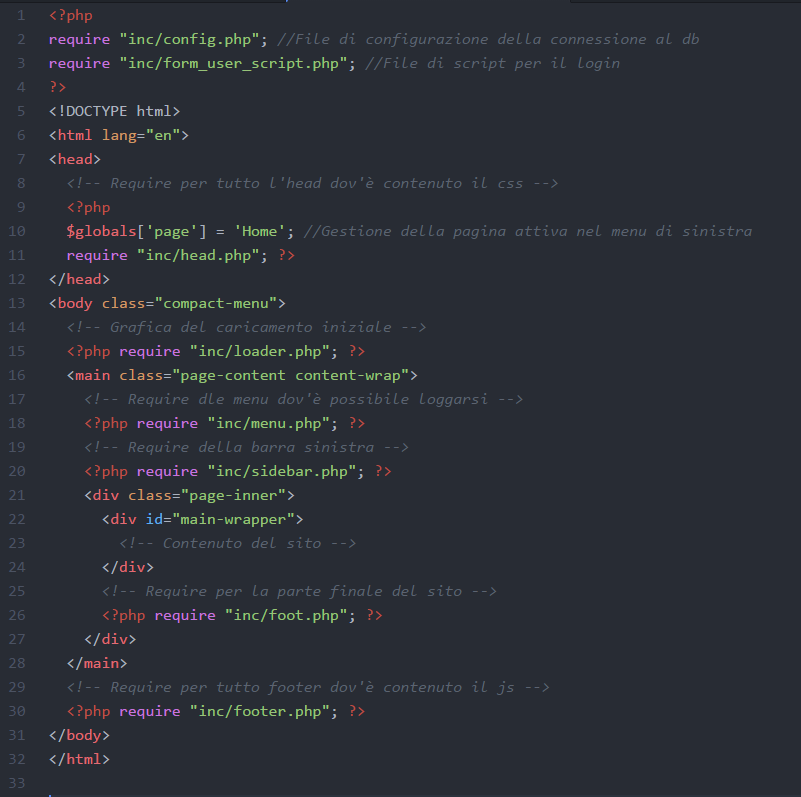

# Survey Station

1. [Introduzione](#introduzione)

  - [Informazioni sul progetto](#informazioni-sul-progetto)

  - [Abstract](#abstract)

  - [Scopo](#scopo)

2. [Analisi](#analisi)

  - [Analisi del dominio](#analisi-del-dominio)

  - [Analisi dei mezzi](#analisi-dei-mezzi)

  - [Analisi e specifica dei requisiti](#analisi-e-specifica-dei-requisiti)

  - [Pianificazione](#pianificazione)

3. [Progettazione](#progettazione)

  - [Design dell’architettura del sistema](#design-dell’architettura-del-sistema)

  - [Design dei dati e database](#design-dei-dati-e-database)
  
  - [Arduino](#arduino)

4. [Implementazione](#implementazione)

5. [Test](#test)

  - [Protocollo di test](#protocollo-di-test)

  - [Risultati test](#risultati-test)

  - [Mancanze/limitazioni conosciute](#mancanze/limitazioni-conosciute)

5. [Consuntivo](#consuntivo)

6. [Conclusioni](#conclusioni)

  - [Sviluppi futuri](#sviluppi-futuri)

  - [Considerazioni personali](#considerazioni-personali)

7. [Sitografia](#sitografia)

8. [Allegati](#allegati)

## Introduzione

### Informazioni sul progetto

  -   Allievi: Jeremy Jornod, Nicola Mazzoletti, Jonathan Fassora, Riccardo di Summa, Jacopo Greppi

  -   Docente responsabile: Luca Muggiasca

  -   Scuola Arti e Mestieri Trevano (SAMT)

  -   Inizio: 27.01.2017

  -   Consegna: 12.05.2017

### Abstract

>* The following document has the goal to illustrate the process of developement behind our creation: Survey Station.
This project was conceived to gather seismological data from an accelerometer (and in the future other types of detectors) and then show it on a website.
In this page is recorded the process by which we, a team of five students, could create a system that can not only pick up data, but can analyze it as well, thus allowing the user to consult the recorded relevant informations.

### Scopo

  Lo scopo del progetto è quello di avere un centro di raccolta di vari dati rilevati da una stazione. I risultati dei rilevamenti verrano mostrati su una pagina web che permetterà di visualizzare un grafico con i valori raccolti e che avrà una funzione di notifica in caso di misure interessanti. Inoltre saranno sfruttati i dati raccolti da centri professionali (p.es oasi.ch e seismo.ethz.ch) come strumento di comparazione. Questo sito ha dunque uno scopo di monitoraggio e raccolta di differenti misure nell'ambiente esterno, raggruppando tutti questi dati in un solo luogo che ne permette la consultazione.

## Analisi

### Analisi del dominio

  Il prodotto dovrà lavorare in un contesto scolastico e 'artigianale', come forma di raccolta e visualizzazione dati più per curiosi che per professionisti. La pagina sarà dunque ovviamente limitata, l'intenzione non è quella di creare un centro geologico o metereologico, ma di avere una piccola stazione di rilevamento e misurazione. L'idea è dunque quella di costruire una 'miniatura' di siti professionali (p.es. sed.ch) in modo, come detto, artigianale e 'casalingo'.

  Per fare ciò è necessario anche un piccolo lavoro di ricerca per capire i fenomeni con cui si sta lavorando e soprattutto i numeri che si stanno raccogliendo. Una volta compresi determinati concetti si sarà così in grado di migliorare la misurazione e la presentazione dei dati. Proprio questa presentazione deve riuscire ad essere adeguata al pubblico cui si rivolge, ovvero non necessariamente geologi diplomati, ma più probabilmente dei curiosi che vogliono sapere qualcosa in più, o semplicemente fare una piccola analisi degli ultimi dati ottenuti.

### Analisi e specifica dei requisiti

|ID  |REQ-001                                         |
|----|------------------------------------------------|
|**Nome**    |Sismografo |
|**Priorità**|1                     |
|**Versione**|1.0                   |
|**Note**    ||
|            |**Sotto requisiti** |
|**001**      | Costruzione di un sismografo in grado di rilevare le vibrazioni del terreno |
|**002**      | Lo stesso (tramite Arduino o simili) deve essere in grado di inviare i dati al server |

|ID  |REQ-002                                         |
|----|------------------------------------------------|
|**Nome**    |Altri sensori |
|**Priorità**|1                     |
|**Versione**|1.0                   |
|**Note**    ||
|            |**Sotto requisiti** |
|**001**      | Sulla base del sismografo dev'essere possibile aggiungere altri strumenti di misura alla stazione (p.es. barometro o termometro) |
|**002**      | Di nuovo sulla base del sismografo la stazione deve poter inviare i dati al server |

|ID  |REQ-003                                         |
|----|------------------------------------------------|
|**Nome**    |Salvataggio dati|
|**Priorità**|1                     |
|**Versione**|1.0                   |
|**Note**    ||
|            |**Sotto requisiti** |
|**001**      | Non è necessario salvare a lungo termine tutti i dati ricevuti dalla stazione|
|**002**      | Quando i valori entrano in una soglia interessante i dati vengono raccolti e archiviati|

|ID  |REQ-004                                         |
|----|------------------------------------------------|
|**Nome**    | Allarmi e notifiche|
|**Priorità**|1                     |
|**Versione**|1.0                   |
|**Note**    ||
|            |**Sotto requisiti** |
|**001**      | Gli allarmi e le notifiche scattano al superamento di una soglia definita |
|**002**      | Gli utenti registrati, se hanno settato l'opzione, ricevono un e-mail di avviso |
|**003**      | Sulla pagina web viene mostrato l'allarme |
|**004**      | Le e-mail vengono inviate a intervalli regolari in caso di allarme (timespan configurabile), per evitare l'invio continuo all'utente |
|**005**      | Deve essere presente una notifica anche sulla stazione fisica (p.es un LED) |

|ID  |REQ-005                                         |
|----|------------------------------------------------|
|**Nome**    | Admin e utenti|
|**Priorità**|1                     |
|**Versione**|1.0                   |
|**Note**    ||
|            |**Sotto requisiti** |
|**001**     | Deve esserci un form di login e di registrazione |
|**002**     | L'admin ha accesso a una dashboard di gestione |
|**003**     | La registrazione richiede un indirizzo e-mail (univoco nel sistema) e una password |
|**004**     | Gli utenti devono avere la possibilità di cambiare la password |
|**005**     | L'admin può gestire le configurazioni (vedi REQ-006) |
|**006**     | L'admin può gestire gli utenti |

|ID  |REQ-006                                         |
|----|------------------------------------------------|
|**Nome**    | Configurabilità moduli |
|**Priorità**|1                     |
|**Versione**|1.0                   |
|**Note**    ||
|            |**Sotto requisiti** |
|**001**     | Per ogni modulo devono essere configurabili le soglie di valori interessanti |
|**002**     | Per ogni modulo deve essere configurabile il tempo della durata di una misurazione (p.es. un terremoto che non ha picchi per X minuti è da considerarsi concluso) |
|**003**     | Dovranno poi essere configurabili altri parametri |

|ID  |REQ-007                                         |
|----|------------------------------------------------|
|**Nome**    | Raccolta e confronto dati professionali|
|**Priorità**|1                     |
|**Versione**|1.0                   |
|**Note**    ||
|            |**Sotto requisiti** |
|**001**     | È necessario confrontare i dati raccolti con quelli del SED (http://www.seismo.ethz.ch/) |
|**002**     | Questo confronto dev'essere visibile all'utente (sul grafico o tramite tabella) |
|**003**     | I dati vengono raccolti a intervalli regolari (non troppo frequenti a causa del traffico generato) |

|ID  |REQ-008                                         |
|----|------------------------------------------------|
|**Nome**    | Visualizzazione e rappresentazione dati|
|**Priorità**|1                     |
|**Versione**|1.0                   |
|**Note**    ||
|            |**Sotto requisiti** |
|**001**     | I dati raccolti per ogni modulo devono essere mostrati sulla pagina web tramite un grafico con il tempo in ascissa. |
|**002**     | I dati salvati devono essere consultabili |

|ID  |REQ-009                                         |
|----|------------------------------------------------|
|**Nome**    | Modulabilità|
|**Priorità**|1                     |
|**Versione**|1.0                   |
|**Note**    ||
|            |**Sotto requisiti** |
|**001**     | I moduli hanno delle configurazioni che possono essere definite dall'admin (vedi REQ-006) |
|**002**     | Ogni modulo dispone della sua sezione sul sito, con tabella nel DB per il salvataggio dei valori e grafico per la visualizzazione |

### Pianificazione

In questo capitolo è esposto il Gantt preventivo per l'organizzazione del lavoro.

Preventivo costi:

|Risorsa  |Prezzo                                         |
|----|------------------------------------------------|
|**Accelerometro**    | 10 CHF |
|**Personale**| 50 CHF/h * 150 h lavoro * 5 = 37500               |
|**Arduino Ethernet**| 20 CHF                |

 

### Analisi dei mezzi

#### Hardware
|Tipo componente  |Utilizzo nel progetto|Datasheet|
|-----------------|--------------------------------|----|
|1x Accelerometro|Componente principale, viene utilizzato per ricevere i dati dell'accelerazione nel caso di un sisma|Vedi allegato|
|1x Led RGB|Utilizzato per creare un segnale fisico sulla scheda||
|1x Veroboard|Utilizzata per saldare i componenti su di essa||
|7x cavi arduino|Utilizzati per collegare i componenti saldati all'arduino||
|1x Arduino Ethernet|Utilizzato per trasmettere i valori dell'accelerometro al database e per controllare il led rgb||
|1x Raspberry pi 2|Utilizzato come webserver e database server||

#### Software
|Nome software|Versione|Utilizzo nel progetto|
|--------|---------|--------------------------------|
|Raspbian| April 2017|Utilizzato come sistema operativo di raspberry|
|Apache| 2.2|Webserver|
|PHP| 5.6|Gestione di php|
|Mysql| 5.5|Database|

#### Altro
|Nome |Utilizzo nel progetto|
|-----------------|--------------------------------|
|Officina| Utilizzata per saldare i componenti e creare una base per la survey station|

## Progettazione

### Design dell’architettura del sistema

Il sistema si basa su 3 grossi passaggi di funzionamento.
In primo luogo c'é l'Arduino collegato a vari sensori, questo si occupa di inviare tramite la rete Ethernet i dati rilevati.
Il secondo punto è rappresentato da un (web)Server che implementa il database. Nel DB i dati vengono raccolti e vengono già parzialmente lavorati.
In questa fase è importante notare la presenza di Raspberry, è infatti quest'ultimo che funge da WebServer, questo è un dettaglio che è stato pensato solo in seguito, quando ci si è resi conto che il servizio che doveva ospitare il lavoro non era adatto alle nostre esigenze.
Nel Raspberry è implementato un semplice sistema LAMP su una scheda da 16 GB.
Infine c'é l'utente che chiama la pagina, questo livello è l'ultimo nel percorso dei dati.
Il codice PHP preleva i dati dal DB, li adatta alla visualizzazione sulla pagina e infine li invia alla stessa.
Questo schema ha il vantaggio di poter essere applicato facilmente a qualunque tipo di rilevamento (prendendo chiaramente coscienza di quello che si sta misurando).

  

Di seguito uno schema che rappresenta l'archietettura della pagina web, essa è costruita in base a pagine php che vengono utilizzate con 'require'. Questo facilita la comprensione, ottimizza i files utilizzati e facilita la modulabilità.

 
 

### Design dei dati e database

La parte di design dei dati ha la funzione di mostrare che tipi di dati sono stati assegnati ai vari attributi delle tabelle presenti nel database. L'immagine che segue mostra il design dei dati del database "surveyStation", usato per questo progetto.

 
Nei campi "Amministratore" e "Email_Notification" ho usato il tipo di dato "tinyint" poiché è molto più conveniente che usare un altro tipo di flag. Si sarebbe potuto usare ad esempio un int e dire che se il campo equivale a 0 il valore è false, mentre se è 1 equivale a true. Sarebbe stata una soluzione che avrebbe portato allo stesso risultato, ma il tipo di dato int è indubbiamente più pesante rispetto al tinyint che assume solamente 2 valori. Per ottimizzare il database, le risorse e la memoria ho deciso di utilizzare questo tipo di dato. Nel nostro progetto la differenza potrebbe non sentirsi poiché le query non occupano tante linee di codice, ma in altri progetti l'ottimizzazione della memoria è cruciale ed è quindi meglio prevenire i disagi legati alle prestazioni.
 
Lo stesso discorso vale per la scelta effettuata sugli identificatori di ogni tabella. Ho utilizzato il tipo di dato int al posto di un dobule o di un float poiché le chiavi primarie sono sempre caratterizzate da numeri primi e quindi sarebbe stato inutile e dispendioso utilizzare dei tipi di dato che usano la virgola.
 
Nelle tabelle sismografo e shake, nei campi dove vanno inseriti i valori, ho preferito optare per un tipo di dato int piuttosto che altri poiché per la nostra analisi vanno benissimo i numeri senza virgola. Ciò comporta, come spiegato in precedenza, un miglioramente delle prestazioni e un risparmio di memoria.
 
 

### Schema E-R, schema logico e descrizione.

Lo schema E-R è fondamentale per la creazione di un database e quindi sono dovuto partire da qui per poi passare a scrivere il codice sql. Qui di seguito si può osservare come ho pensato di strutturare il database con le rispettive tabelle.

 
Per creare questo schema ho pensato a come questo progetto verrà utilizzato. Ovviamente diverse persone vi accederanno con il proprio account e ciò mi ha fatto subito pensare ad una tabella che gestisca gli utenti che usufruiscono del servizio da noi messo in piedi.
 
L'arduino, al quale è attaccato un sensore, si occupa di percepire le vibrazioni terrestre che avvengono e quindi i dati da esso registrati devono essere registrati da qualche parte. Da qui è nata la tabella sismografo. 
 
Ovviamente, e auspicabilmente, la maggior parte dei dati registrati dall'arduino ed inseriti nella tabella sismografo sono insignificanti poiché non permettono di osservare nulla. La parte "interessante", dal punto di vista d'analisi, si verifica quando vi è una scossa di ciò che secondo l'arduino è etichettabile come una scossa di terremoto. Ho creato la tabella Shake per poterci inserire i dati interessanti e in modo da facilitare il lavoro anche a coloro che si sono occupati della rappresentazione grafica dei dati in questione.
 
Salta subito all'occhio che le tabelle presenti nello schema non sono in nessun modo relazionate tra di loro. Non si tratta di un errore o di disattenzione, ma semplicemente per raggiungere il nostro obiettivo non c'era il bisogno di creare delle relazioni. 
 
Nella tabelle "utente" l'identificatore primario è il campo "email". Abbiamo optato per questa soluzione poiché due o più utenti non possono avere lo stesso indirizzo email e ciò fa risparmiare anche memoria, oltre che a rendere più ordinata e pulita la tabella e il codice che la riguarda.  

### Design procedurale

### Arduino

#### Struttura

La struttura è stata progettata per contenere Raspberry, Arduino, Veroboard (con su saldati accelerometro e led) e Breadboard per eventuali lavori o aggiunte future.

L'accelerometro è stato collegato ad un Arduino con il collegamento per il cavo Ethernet tramite i pins 'scl' e 'sda', poi per l'alimentazione del componente viene usato un voltaggio di 3,3V e infine viene collegato al gnd per andare a massa.
Il led RGB viene collegato al gnd, al pin 6 per il colore rosso e 5 per il colore verde, il pin blu del componente non viene utilizzato poichè al momento non serve il colore blu in quanto questo led viene utilizzato come segnale in caso di rilevamento di un sisma, in questo caso il led diventerà di colore rosso, nel secondo caso quando non viene rilevato niente, il led rimarrà di colore verde.

#### Codice
Lo scopo di Arduino e del suo codice è quello di prelevare i dati rilevati dall'accelerometro, contattare il server e la pagina PHP di riferimento, creare l'URL con i relativi valori e spedirli. Oltre a ciò si deve occupare di controllare i dati e, nel quale ci fosse un'anomalia o un terremoto, illuminare l'apposito led.
 
Il codice di Arduino importa tre librerie esterne:
- <b>Ethernet:</b> include tutte le funzioni per eseguire le connessioni e le richieste.
- <b>SPI:</b> serve da supporto alla libreria Ethernet.
- <b>SFE_MMA8452Q:</b> questa libreria implementa la completa gestione dell'accelerometro.

 
<b>Attributi:</b>

- <b>redPin:</b> È il pin con cui alimentare il colore rosso del led.  
- <b>greePin:</b> È il pin con cui alimentare il colore verde del led.  
- <b>mac:</b> È il MAC Address della scheda Arduino.  
- <b>serverIp:</b> È l'indirizzo IP del server.  
- <b>arduinoIp:</b> È l'indirizzo IP di Arduino.  
- <b>client:</b> È il client ethernet. Serve a contattare il server e la pagina PHP.  
- <b>strURL:</b> È la stringa URL che si spedirà tramite client. All'interno di essa si formatterà un URL con la pagina da chiamare e i valori di X, Y e Z.  
- <b>accel:</b> È l'istanza dell'accelerometro.

 
<b>Funzioni:</b>

- <b>setup(): </b> Funzione di settaggi e istanze. 
- <b>loop(): </b> Innanzitutto richiama la funzione updateValues. Dopodichè controlla se il client è disponibile. Se non lo è stampa un messaggio d'errore. 
- <b>updateValues(): </b> Per prima cosa si connette al server, successivamente controlla se l'accelerometro è disponibile. Nel caso di un riscontro positivo si verificano le coordinate prelevate dal sensore. Infine si crea la stringa con i valori formattata con le regole di un URL. 

#### Pagina PHP
Il lavoro che deve fare la pagina PHP è quello di recuperare X, Y e Z dall'URL trasmesso da Arduino. Dopodichè deve connettersi al database "surveystation" e alla tabella "sismografo". La pagina si deve occupare di creare la query e di eseguirla correttamente.

## Implementazione

### Arduino

#### Struttura

#### Codice
<b>I tre include delle librerie:</b>

<b>Le istanze degli attributi principali:</b>

 
 
 
 
 

<b>Il setup:</b>

Il metodo <b>*.init()*</b> serve a settare due attributi fondamentali. Il primo attributo è la scala dei valori acquisiti dal sensore. Si possono settare 3 scale differenti: SCALE_2G, SCALE_4G e SCALE_8G.
Il secondo attributo invece si occupa di impostare la frequenza di rilevamento. La gamma dei valori è vasta e parte da ODR_1 (1.56 Hz) fino ad arrivare a ODR_800 (800 Hz).

<b>Il loop:</b>

Il loop serve principalmente a richiamare *updateValues()* e a scrivere sulla seriale lo stato delle connessioni.

<b>UpdateValues:</b>

Come prima cosa si conette al server. Il metodo *.connect()* accetta due parametri. Il primo parametro è l'indirizzo ip del server: il tipo deve essere <b>IPAddress</b>. Il secondo parametro è la porta tramite cui Arduino deve accedere.

Il secondo passo è quello di vedere se l'accelerometro è disponibile. Se così fosse, si può passare a leggere i valori rilevati dal sensore. Il metodo *.read()* serve a leggere l'accelerazione delle tre assi. Fatto ciò si può recuperare la singola accelerazione tramite: *.cx*, *.cy* e *.cz*. Si potrebbe usare anche: *.x*, *.y* e *.z* ma i valori ottenuti da questi attributi sarebbero stati assoluti. Con la seconda opzione invece i valori fanno riferimento allo zero.

Il terzo passo riguarda la creazione della stringa URL e la spedizione al server. I tre valori X, Y e Z vengono passati tramite l'URL e alle apposite variabili. Nel punto in cui bisogna inserire l'indirizzo IP dell'host si inserisce l'indirizzo del server. Dopo aver spedito l'URL si chiude la connessione.

#### Pagina PHP

<b>Valori:</b>

All'inizio si controlla l'esistenza delle variabili x, y e z. Se è tutto a posto allora si procede con il salvare i valori in tre variabili all'interno di PHP.

<b>Connessione MySQL:</b>

Si crea una variabile *$link* che contiene la connessione a MySQL. All'interno del metodo *mysql_connect* bisogna inserire l'indirizzo ip (in questo caso localhost perchè la pagina PHP si trova all'interno della root), nome dell'utente che accede al database e la sua relativa password.
Nella riga sotto si gestisce l'errore nell'evenienza di qualche problema con la connessione.
Successivamente ci si connette al database *surveyStation*.

<b>Query:</b>

Per creare una query bisogna innanzitutto creare una stringa con la formattazione corretta. In questo caso si esegue un inserti dei valori X, Y e Z.
Per eseguire la query si dovrà utilizzare il metodo *mysql_query* dove quest'ultimo accetta due parametri: *$sql* (la stringa contenente la query) e *$link* (la connessione a MySQL).
Nella riga seguente si controlla se l'esequzione della query è avvenuta correttamente.
Infine si chiude la connessione al database con il metodo *mysql_close*.

### Database
Una volta terminata la progettazione del database bisogna implementare/mettere in pratica ciò che si è fatto in maniera teorica. Come primissimo passo ho iniziato a scrivere il codice sql delle tabelle presenti sul database dato che senza di esse non è possibile lavorare. 
 

 
L'immagine qui sopra rappresenta il codice che ho ideato e scritto per la creazione delle tabelle "utenti" e "configurazione". La struttura delle linee è la classica di quando si crea una semplicissima tabella. Una piccola particolarità è l'attributo "unique" nel campo "email". Dato che quest'ultimo è la chiave primaria e che non ci saranno mai due indirizzi email uguali tra di loro, ho fatto in modo che queste restrizioni vengano rispettare tramite quell'attributo.
 
 

 
L'immagine appena inserita mostra il codice sql che ho scritto per la creazione delle tabelle "sismografo" e "shake". Potrebbe saltare subito all'occhio il fatto che non sono collegate tra di loro tramite delle foreign key. Ciò non è una dimenticanza o un errore di progettazione, ma semplicemente riflettendo sulla situazione che si è presentata, sono giunto alla conclusione che non fosse necessario relazionarle.
 
 
Nella tabella configurazione sono presenti dei campi i cui valori saranno usati successivamente nel trigger e nelle procedure. 
 

 
Sapendo che avrei avuto bisogno di campi che memorizzassero ogni quanto cancellare dei dati, dopo quanti minuti le scosse vengano catalogate come nuovi terremoti, che valore minimo viene considerato come "scossa di terremoto" e quanti sono i minuti che precedono un picco, ho inserito questi dati nella tabella. Quest'ultima si è resa necessaria poiché l'amministratore può modificare i dati a proprio piacimento e il codice agirà di conseguenza. Al contrario, egli avrebbe dovuto far passare ogni riga di codice e vedere dove fosse inserito uno di questi valore e lo avrebbe dovuto cambiare manualmente. Ciò è estremamente scomodo, dispersivo, fa perdere tempo e incrementa tantissimo la possibilità di commettere un errore che andrebbe a compromettere il funzionamento del progetto.
 
 
Come ho già accennato precedentemente, per un fattore di analisi, a noi interessa poter immagazzinare i dati che precedono un terremoto. Ovviamente non ci interessano tutti, ma quelli che rientrano in un determinato range temporale (dettato da uno dei valori che ho inserito nalla tabella "configurazione"). Per questioni pratiche (date dal fatto che dovevo provare se il codice funzionasse) ho inserito il valore "1". In una situazione reale il numero di minuti sarà sicuramente maggiore. 
Per permettere di monitorare tutto ciò ho creato una procedura.
 

 
È possibile notare come la procedura necessiti di 2 parametri. Il primo "shakeId" rappresenta l'indenficativo di ogni terremoto, mentre il secondo (a) rappresenta il valore che indica il range temporale per salvare i dati. Se dovesse valere 2, significherebbe che la procedura dovrebbe iniziare ad immagazzinare i dati partendo da 2 minuti fa rispetto a quando si verifica un picco di dati. Una volta selezionati i dati a partire ad "a" minuti prima di un picco dalla tabella sismografo, essi vengono spostati nella tabella shake. Lo scopo di quest'ultima è proprio quello di conservare tutti i dati considerati importanti dal punto di vista di analisi. Per ulteriori dettagli sul funzionamento di ogni singola riga di codice si possono leggere i commenti dato che sono esplicativi.
 
 
Come ho già accennato nella spiegazione della procedura, vi deve essere la possibilità di inserire i dati della tabella sismografo nella tabella shake a partire dall'individuamento di un determinato valore. Come abbiamo visto anche in classe durante le lezioni, per poter fare ciò è necessario l'utilizzo di un trigger.
 

 
Si può notare come nel trigger io vada ad utilizzare nuovamente le variabili contententi i valori della tabella configurazioni. Ciò rende tutto più modulabile e riduce la possibilità di commettere degli errori. Anche qui, il codice da me scritto continene su ogni riga un commento che ne va a spiegare il funzionamento.
 
 
Dato che nella tabella sismografo verranno inseriti tutti i dati, e la gran maggioranza saranno inutili per il nostro progetto, quest'ultima si riempirà con estrema facilità in poco tempo. Per ovviare a questo problema ho scritto una procedura che cancelli i dati della tabella sismografo. Ovviamente non tutti i dati vengono cancellati, ma solamente quelli più vecchi di "d" minuti che è un parametro specificato nella tabella configurazione. Se quest'ultimo valesse 60, una volta chiamata la procedura nella tabella sismografo rimarrebbero solamente i dati non più vecchi di un'ora. Come già detto, ciò viene fatto per non intasare il database.
 

 
 
Ovviamente il sistema deve essere automatizzato e non devo essere una persona a chiamare le procedure manualmente. Ho creato un evento per ogni procedura che ogni lasso temporale specificato nel codice andasse ad eseguire la sua procedura.
 

 

### Sito Web

#### Struttura di base del sito

Il sito viene creato utilizzando i file presenti nella cartella /inc, la struttura di base è la seguente:

#### Data.php e comunicazione con il grafico

##### Data.php

La pagina data.php è il cuore pulsante dell'esposizione dei dati nel grafico.
Questo file viene chiamato ripetutamente tramite ajax e fornisce i dati che vengono continuamente inseriti nel database da Arduino.
Nella prima parte del codice ci sono dei parametri che permettono di adattare il grafico senza dover modificare le viscere del codice.

Il numero di dati permette di adattare la visualizzazione, un numero basso avrà un grafico più rapido, un numero più alto permette invece di vedere un timespan più grande. Da notare che un numero eccessivamente elevato (>1000) penalizzerà sensibilmente le prestazioni.
C'é poi un parametro di moltiplicazione, nel caso in cui si voglia avere un range diverso dei dati.
Si possono poi definire delle transizioni per i 3 valori, in questo modo le linee possono essere mosse sull'asse delle ordinate a piacimento (in questa situazione bisognerebbe poi andare a modificare il minimo e il massimo sull'asse Y nel grafico).

La query che viene ripetuta seleziona $nrDati di dati e in seguito li inverte, fatto questo riordina i risultati in base all'id.

I dati vengono presi dal risultato della query e inseriti in 4 array diversi.

Completato il processo i 4 gruppi di dati vengono inseriti in un grosso array che viene poi mandato in ritorno in formato json.

##### Grafico FLOT

Il grafico è un oggetto messo a disposizione da flotchars JavaScript (http://www.flotcharts.org/) e poi adattato al nostro utilizzo.

La funzione showHint() viene chiamata ripetutamente tramite AJAX ogni tot. millisecondi (definiti in setInterval).

I dati ricevuti vengono decodificati da JSON e vengono poi inseriti nei dataset utilizzati dal grafico. Le date verrano utilizzate come ticks (ovvero i labels sull'asse X).
 

## Test

### Protocollo di test

### Risultati test

### Mancanze/limitazioni conosciute

## Consuntivo

Di seguito il GANTT di consuntivo, l'implementazione del server su Raspberry al posto dell'appoggiamento su servizio esterno ha provocato rallentamenti.

Consuntivo costi:

|Risorsa  |Prezzo                                         |
|----|------------------------------------------------|
|**Accelerometro**    | 6 CHF + 10 spedizione = 16 CHF |
|**Personale**| 50 CHF/h * 142 h lavoro * 5 persone = 35500              |
|**Arduino Ethernet**| 0.- (già a disposizione)                |

 

## Conclusioni

### Sviluppi futuri

  - Il primo sviluppo che si può applicare è sicuramente quello del collegamento di nuovi sensori, la struttura applicata permette di eseguire questa operazione senza troppi problemi, posto che si sappia il tipo di valori rilevati.
  
  - Per ottenere più solidità si potrebbe in futuro appoggiarsi a un servizio di hosting esterno (che permetta l'utilizzo di procedure e simili, chiaramente), in questo modo ci si distacca dal Raspberry che è meno stabile. Altra possibilità in questo senso è quella di utilizzare il Raspberry come 'passaggio intermedio' per poi trasferire la grossa mole di dati su un database esterno.
  
  - Importante per continuare il lavoro sarebbe capire completamente le funzionalità dell'Accelerometro, c'é la possibilità per esempio di calibrarlo settando degli offset (e rimuovendo quindi il 'rumore' di accelerazione che viene rilevato, per esempio la gravità), si potrebbe poi sfruttare le sue altre funzionalità (quali ad esempio il landscape o lo standby).
  
  - Si potrebbe poi andare ad implementare il sistema di allarmi e notifiche, utilizzando un server mail (interno o esterno) si potrebbe avvisare l'utente che qualcosa di interessante è successo.
  
  - Infine potrebbe essere interessante utilizzare un sistema di 'traduzione' in scale più conosciute dei dati sismologici rilevati (la scala Richter non è un'opzione in quanto non è direttamente collegata ai valori di accelerazione).

### Considerazioni personali
* Jacopo Greppi
  * Inizialmente quando ci è stato assegnato il progetto ero totalmente spiazzato poiché mi sembrava un lavoro talmente impegnativo e complicato che non pensavo che ce l'avessi potuta fare. Piano piano abbiamo iniziato a suddividerci il lavoro, io ero incaricato di progettare, creare e gestire il database, e quella nebbia di incertezze ha iniziato a diradarsi. L'idea del progetto l'ho trovata molto interessante poiché ci ha permesso di creare qualcosa che si può applicare per un uso reale nella vita di tutti i giorni. Ovviamente ci sono state diverse difficoltà durante tutto il percorso, ma questo mi ha permesso di mettermi alla prova e di valutare le mie capacità. Ho ovviamente imparato alcune nozioni che durante i vari moduli non abbiamo trattato e ciò è molto positivo perché ho avuto l'opportunità di ampliare il mio bagaglio culturale. 
  
 * Nicola
	* Il progetto è stato interessante, ho imparato diverse cose nuove e messo in pratica alcune di quelle che già conoscevo. È stato interessante in quanto siamo riusciti a far comunicare un arduino con un raspberry e questo può tornare utile anche in progetti futuri. Penso che il progetto di per se sia uscito bene e che magari può tornare utile in futuro, magari modificando qualche parte. 
	
* Jeremy
	* Il progetto personalmente mi è piaciuto, penso sia stato utile per migliorare le mie skills in programmazione, mi sono trovato bene con il team di sviluppo e in fine dei conti penso anche che siamo riusciti a portare un buon prodotto finale, sia nella parte software che in quella hardware.  Questo progetto potrà magari tornare utile in futuro con qualche variazione o ampliamento.

## Bibliografia

### Sitografia
* https://dev.mysql.com/doc/refman/5.7/en/, MySQL 5.7 Reference Manual, 5.5.2017
* https://www.w3schools.com/sql/DEfaULT.asP, Sql Tutorial, 5.5.2017
* https://github.com/sparkfun/SparkFun_MMA8452Q_Arduino_Library, MMA8452Q Accelerometer Library, 7.4.2017
* https://www.raspberrypi.org/, Varie pagine, 21.4.2017
* http://www.flotcharts.org/, Flot Charts JS, 10.2.2017
* http://www.nxp.com/assets/documents/data/en/data-sheets/MMA8452Q.pdf, MMA8452Q Data Sheet (anche in allegato), 7.4.2017
* https://www.sparkfun.com/products/12756, guide su come utilizzare l'accelerometro, 10.3.2017

## Allegati
* Database
  * Schema ER
  * Schema del design dei dati
  * file sql per creare il database del progetto

* Diari
* Quaderno dei compiti (qdc)
