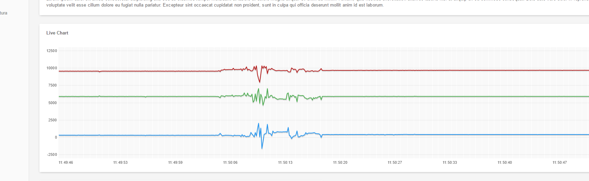

# PROGETTO | Diario di lavoro - 17.03.2017

### Canobbio, 17.03.2017

## Lavori svolti
##### Jeremy Jornod
|Orario        |Lavoro svolto                 |
|--------------|------------------------------|
|8.20 - 9.20: | Abbiamo sistemato la scala dei valori che non andava settimana scorsa. Praticamente i valori erano dei float e noi li mandavamo al database come double. Ora funziona. Abbiamo cambiao metodi.|
|9.20 - 15.45: | Richiamare una pagina PHP con Arduino: Database, pagine PHP, codice Arduino. C'è un problema a livello di server. Devo capire come cambiare i permessi. |

##### Jonathan Fassora
|Orario        |Lavoro svolto                 |
|--------------|------------------------------|
|8:20 - 12:20   |Grafico live con dati reali, x y z|
|12:20 - 15:45   |Configurazioni dell'amministratore + fix registrazione|

##### Jacopo Greppi
|Orario        |Lavoro svolto                                     |
|--------------|--------------------------------------------------|
|8:20 - 8:35   |Preparazione della postazione di lavoro (accensione computer, collegamento all'alimentazione, apertura dei programmi necessari)|
|8:35 - 9:00   |Briefing con il docente per fare il punto della situazione e per decidere che cosa fare durante la giornata odierna di lavoro|
|9:00 - 11:30  |Verifica del trigger che, una volta letto un certo valore, inizia a copiare i dati importanti nella tabella shake. (Abbiamo sistemato la condizione per la quale prende i dati, l'identificativo del terremoto a cui appartiene e abbiamo aggiunto una procedura che immagazzina i dati precedenti al picco rilevato)|
|11:30 - 12:20 |Ho messo in Github il codice scritto nel punto precedente, ho dovuto fare una piccola modificare nella tabella Shake. Ho invertito i capi 'ID_Sismografo' e 'ID_Shake' per un fattore di logica. Invertendo i due campi, ho dovuto invertili anche nel trigger e nella procedura.|
|13:15 - 14:30 |Ho commentato tutte le parti di codice scritte in mattinata (trigger, procedure, if, select) così la prossima volta che lo leggerò mi ritroverò subito. Ho aggiunto un campo nella tabella degli utenti ('EmailOk') e ho aggiornato lo schema ER e ho caricato le modifiche su GitHub|.
|14:30 - 15:30 |Si vuole fare in modo che certi dati che vengono utilizzati nei trigger e nelle procedure. Quindi sarebbe comodo che siano già configurati in un'ulteriore tabella. Se nella procedura dico che se sono passati 30 minuti e non sono stati registrati dati interessanti, il "30" deve essere all'interno della tabella configurazione così se volessi cambiare questa tempistica mi basterebbe cambiare il valore in quella tabella. Renderebbe molto più ordinato e performante il tutto. Io ho cercato un modo per prendere ed usare quest'informazione.|
|15:30 - 15:45 |Gli ultimi minuti sono stati dedicati alla stesura del diario della lezione odierna.|

##### Nicola Mazzoletti
|Orario        |Lavoro svolto                 |
|--------------|------------------------------|
|8:20 - 10.30  |Risolto il problema dell'invio di dati da arduino al server mysql
|10.30 - 12.20|Progettato la struttura del sismografo|
|13.15 - 14.00|Ripulito il codice per inviare i dati dalle cose che non servivano|
|14.00 - 15.20|cercato di risolvere il problema dei permessi del server|   
|15.20 - 15.45|Diario| 

##### Riccardo di Summa
|Orario        |Lavoro svolto                 |
|--------------|------------------------------|
|8:20 - 15:45   |Grafico live multilinea|
|x - x   |Vari fix (login, configurabilità di qualcosa)|

##  Problemi riscontrati e soluzioni adottate
Oggi non si sono verificati particolari problemi. È stata alquanto tosta la stesura del codice del trigger e della procedura ad esso collegata. Dopo 2 ore di lavoro il trigger svolgeva ciò che doveva fare.

##  Punto della situazione rispetto alla pianificazione
Jeremy --> Finire collegamento Accelerometro - Arduino - Database: fatto

## Programma di massima per la prossima giornata di lavoro
Jonathan / Riccardo --> Ricordarsi di fare piccolo controllo se admin che la query non funziona

Jeremy --> Finire pagina PHP

      

